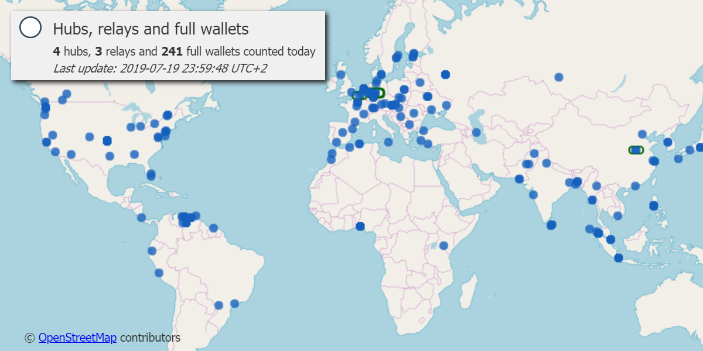
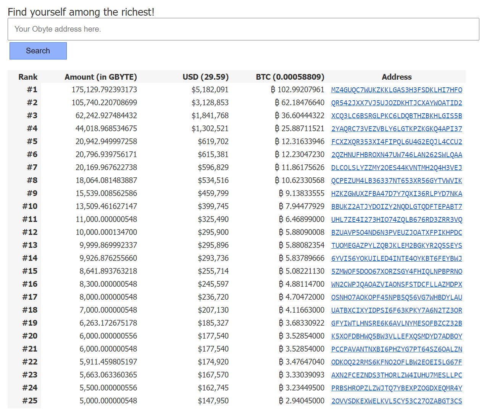
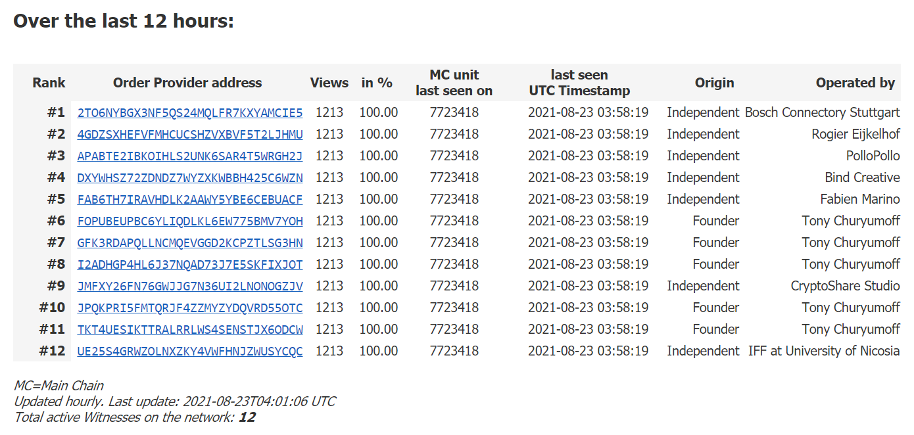
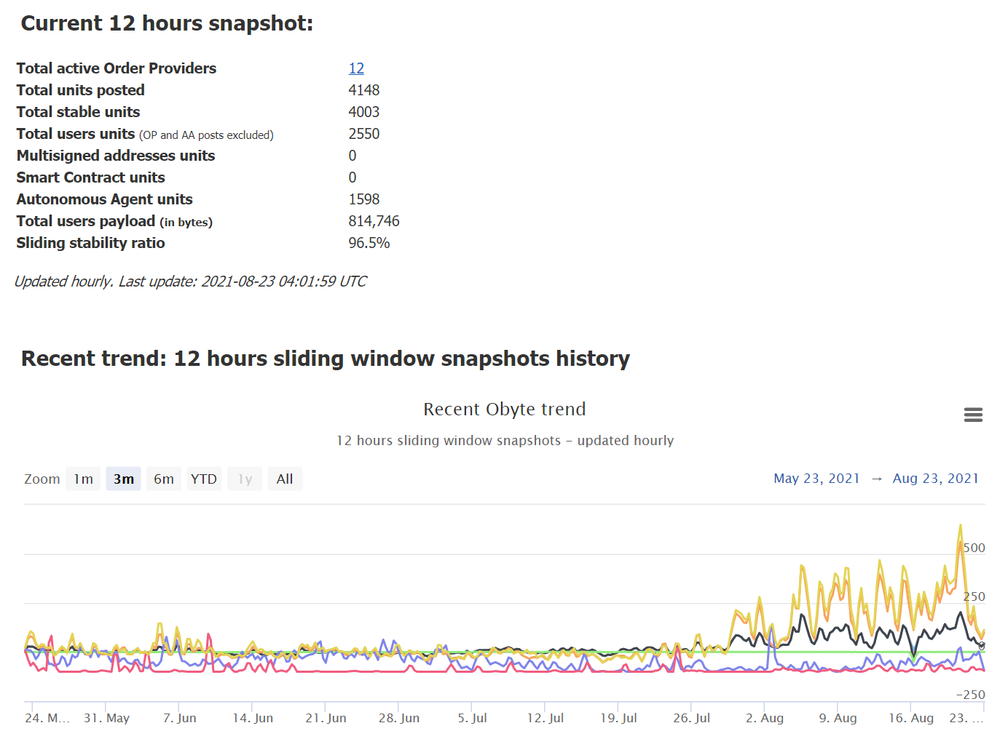

# Obyte statistics
A collection of scripts to render various stats about the Obyte network

## Requirements
* PHP 7+
* SQLite 3+
* Perl 5+
* Node.js 6+
* Obyte hub node
* jquery-2.2.4.min.js
* ipstack.com API key. 
* A licence for HighStock js from https://www.highcharts.com (free for non commercial purpose)

## PHP installation
* `sudo apt-get install nginx`
* `sudo apt-get install php-fpm`
* `sudo apt-get install php-sqlite3`
* `sudo apt-get install php-curl`

### Perl modules
* `sudo apt-get install libdbi-perl`
* `sudo apt-get install libdbd-sqlite3-perl`
* `sudo cpan -fi Date::Parse`
* `sudo cpan -fi DateTime`
* `sudo cpan -fi JSON`

### Statistics database
`sqlite3 stats.sqlite -init sql_tables.sql`

## Screenshots

### Obyte world map:

### Top 100 richest:

### Order Providers:

### Obyte heartbeat:

